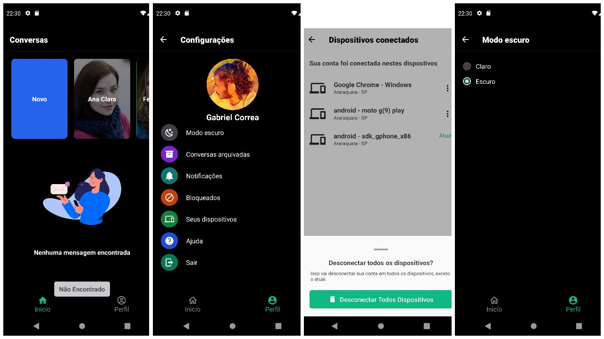

# GbChat
> GbChat from https://gb-chat.tk



## Installation

clone the repository.

```sh
https://github.com/gabrielcorreadev/GbchatApp.git
```

## Usage Project

A few motivating and useful examples of how your product can be used. Spice this up with code blocks and potentially more screenshots.

_For more examples and usage, please refer to the [Wiki][wiki]._

## Development setup

Describe how to install all development dependencies and how to run an automated test-suite of some kind. Potentially do this for multiple platforms.

```sh
cd GbchatApp
npm install
```

run the project.

```sh
npx react-native run-android or npx-react-native run-ios
```

## Release History

* 0.0.1
    * The first proper release
    * CHANGE: Structure of the project`
* 0.0.2
    * Work in progress

## Developer

Gabriel José

## Demo App Android

1. Development
